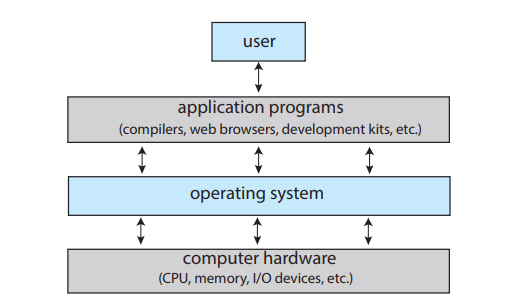
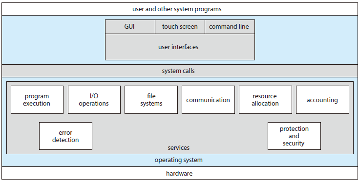
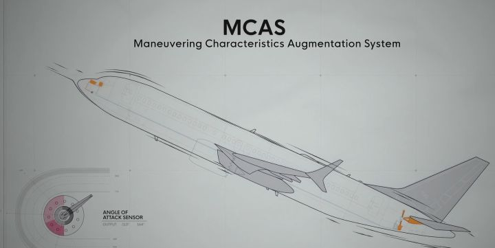
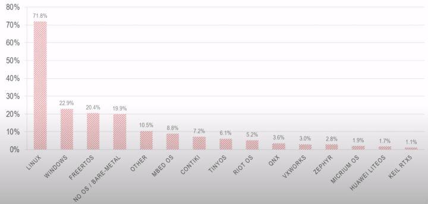
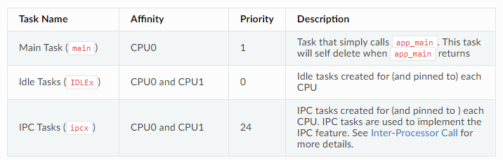
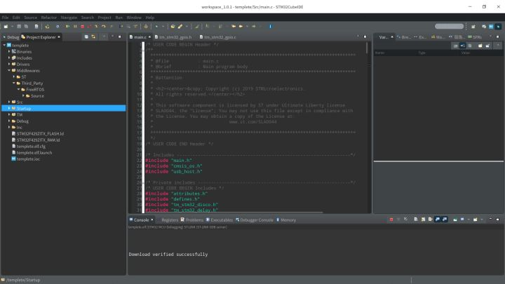
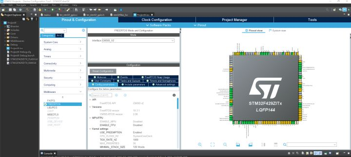
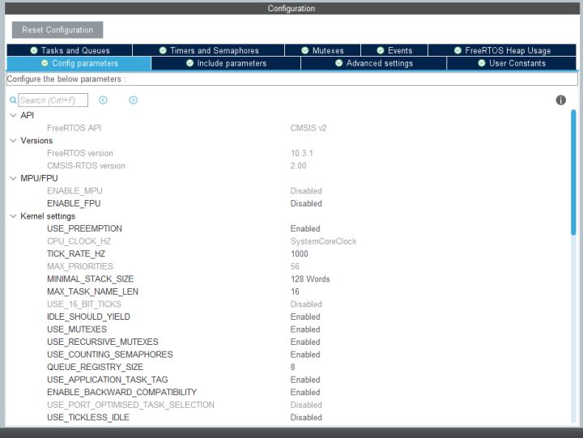

# *Referenced:*

- *FreeRTOS 从入门到精通1--实时操作系统的前世今生 —–奔腾的心 https://zhuanlan.zhihu.com/p/90608412*

## 什么是操作系统

操作系统的定位
 

~操作系统的定位~

### 计算机系统可分为四部分：

1. 硬件（Hardware）
   - 包含CPU，存储空间，输入输出设备等，为整个系统提供基础计算资源。
2. 操作系统（Operating System）
   - 是一个控制程序，作为硬件和应用程序之间的桥梁，主要是和硬件打交道，负责协调分配计算资源和内存资源给不同的应用程序使用，保障系统稳定性。
   - 面对来自不同应用程序的大量且互相竞争的资源请求，操作通过一个调度算法和内存管理算法，尽可能把资源公平且有效率地分配给不同的程序。
3. 应用程序（Application Programs）
   - 通过调用操作系统提供的API接口，获得相应的资源，完成指定的任务。
4. 用户（User）

### 通用操作系统提供的主要功能（概括）

- 任务（应用程序）的调度
- 堆栈和内存管理
- 文件管理
- 队列管理
- 中断和定时器管理
- 资源管理
- 输入输出管理

通用操作系统提供的功能
 

***值得注意的是，操作系统自身需要占用一定的计算资源和内存资源，对于片上资源有限的单片机，针对需求来裁剪操作系统的大小和功能***

### 实时性的含义

#### 实时操作系统（RTOS-Real Time Operating System）中的**实时**（Real Time）指的是任务（Task）或者说实现一个功能的线程（Thread）必须在给点的时间（Deadline）内完成。***业界总有种误解：认为如果能堆砌更多的处理器核心数目，更高的处理器频率，更大的内存和更快的总线速度，系统就能一定达到实时性的表现。***但是强大的计算能力并不能保证系统的实时性。

- 举个例子：比如汽车中的安全气囊，在传感器检测到汽车发生碰撞后，安全气囊需要在30ms内完全打开，不然司机和乘客的人身安全将受到极大的威胁。即使[车载ECU](https://baike.baidu.com/item/ECU/19446326?fr=aladdin)有强大的计算能力，但是如果因为要执行其他复杂计算任务，或者任务调度的问题，导致对汽车状态的检测和安全气囊的响应时间，超过了规定的时间，实时性无法得到保障，导致系统失效和人员伤亡，这将会是非常严重的系统问题。

- 举个例子：特斯拉的车载系统采用的是linux系统，而汽车的驱动模块和刹车模块，使用的是各自独立的系统，整个娱乐系统、触摸屏以及智能驾驶系统，都与汽车驱动完全分开，确保了系统的实时性。

  > The whole entertainment system, those touchscreens, all of the  applications you might load are totally separate from the propulsion of  the car. In fact you could, if you had to, turn off the screens in the  car while driving and the car still drives just fine. You couldn‘t see  your Google Map, but you could still drive and stop and do everything  else.
  >
  > 翻译：整个娱乐系统，那些触摸屏，所有你可能加载的应用程序都与汽车的推进力完全分开。事实上，如果你不得不这样做，你可以在开车时关闭车内的屏幕，汽车仍然可以正常行驶。你无法看到你的谷歌地图，但你仍然可以开车、停车和做其他事情。
  >
  > 
  >
  > —–链接：***[Tesla CTO Talks Model S, Batteries and In-car Linux](https://www.pcworld.com/article/460666/tesla_cto_talks_model_s_batteries_and_incar_linux.html)***

- 一些其他的实时任务包括导弹的制导，无人驾驶等。为了保障这些实时任务能在给定的时间内完成，需要一个实时系统对这些任务进行调度和管理。一个实时操作系统能尽力保障每个任务能在一个已知的最大**运行时间**（Maximum Response Time）内完成，包括：

  - 对中断的内部异常处理
  - 对安全相关事件的处理
  - 任务调度机制等

#### **系统的稳定性不能仅仅依靠实时操作系统，安全功能（fail-safe function）相关的设计也是必须要考虑到的。**

- ​	在Netflix的纪录片《一落千丈：波音大调查》中就提到，导致两起波音最新机型737 Max的失事事故的直接原因在于当飞机的**迎角传感器**发生故障，机上装载的**机动特性增强系统（MCAS）**误认为飞机处于失速状态，无视飞行员的操纵强制自动接管飞机，持续压机头导致了惨剧的发生。可见纵使波音的飞控系统非常稳定，但如果对传感器的数值判定和使用不当并缺少安全性冗余设计，系统的整体稳定性依然无法得到保障。

  

### 操作系统的种类

2018年IoT设备所采用操作系统的倾向性调查
 

- 目前比较流行的实时操作系统包括黑莓QNX，FreeRTOS，uCOS，RT-Thread等。在上图中可以看出，除了Linux和Windows通用操作系统外，接下来便是FreeRTOS受到广大开发者的青睐。图表中也罗列了一些国产的系统。比如腾讯发布和开源的TencentOS tiny，这是一个面向物联网的实时操作系统。华为也推出了鸿蒙LiteOS, 万物互联未来可期。和**实时操作系统**(Real Time Operating System)相对应的是**通用操作系统**(General Purpose Operating  System)。
- 通用操作系统包括Linux，Windows，MAC等主流的操作系统。这些操作系统大家每天都在使用，功能也十分强大，只是它们有时为了保障系统的流畅运行，就不能保证每个程序都能实时响应，在易用性和实时性之间有所取舍。而且**单片机有限的片上资源也不足以支撑通用操作系统的运行**。
- *正所谓术业有专攻*，*在嵌入式领域中，嵌入式实时操作系统(RTOS)可以更合理、更有效地利用CPU的资源，简化应用软件的设计，缩短系统开发时间，从而更好地保证系统的实时性和可靠性。*
- 下面的几个链接分别是FreeRTOS，RT-Thread，TencentOS tiny，鸿蒙LiteOS的源代码链接：
  - [FreeRTOS](https://github.com/freertos)
  - [RT-Thread](https://github.com/RT-Thread)
  - [TencentOs-tiny](https://github.com/OpenAtomFoundation/TencentOS-tiny)
  - [LiteOS](https://github.com/LiteOS/LiteOS)

## FreeRTOS的介绍

> FreeRTOS是一个迷你的实时操作系统内核。作为一个轻量级的操作系统，功能包括：任务管理、时间管理、信号量、消息队列、内存管理、记录功能、软件定时器、协程等，可基本满足较小系统的需要。由于RTOS需占用一定的系统资源(尤其是RAM资源)，只有μC/OS-II、embOS、salvo、FreeRTOS等少数实时操作系统能在小RAM单片机上运行。相对μC/OS-II、embOS等商业操作系统，FreeRTOS操作系统是**完全免费的操作系统**，具有**源码公开、可移植、可裁减、调度策略灵活**的特点，可以方便地移植到各种单片机上运行。 
> —–百度百科
>
> ​	**[FreeRTOS官网](https://www.freertos.org/)**：https://www.freertos.org/

### FreeRTOS的特性

- 具有抢占式或者合作式的实时操作系统内核
- 功能可裁剪，最小占用10kb左右ROM空间，0.5KB的RAM空间
- 灵活的任务优先级分配
- 具有低功耗模式
- 有互斥锁、信号量、消息队列等功能
- 运行过程可追踪
- 支持中断嵌套

### 对称多处理（SMP）

*对称多处理器（Symmetric Multi-Processing）又叫SMP，是指在一个计算机上汇集了一组处理器（多CPU），各CPU之间共享内存子系统以及总线结构。他是相对非对称多处理技术而言的，应用十分广泛的并行技术。*

**在嵌入式系统中通常是指：**

- 芯片有多个核心独立运行，每个核心有自己的寄存器，中断和中断处理
- 共享内存

**对称多处理器相对于绝大多数单核单片机的优势是：**

- 能同时处理更多的任务，吞吐量更大
- 任务在多核处理器中，可以按需切换核心运行，理论上通过优化调度可以达到更高的CPU占有率

ESP32芯片是有双核心（CPU0和CPU1），基于ESP32平台的FreeRTOS是修改支持SMP技术的。下图是ESP32在初始化中任务的创建过程，可以看到不同的任务被分别分配到了CPU0和CPU1。

ESP32初始化中任务的创建
 

详细的技术说明可以参考官方的文档：https://docs.espressif.com/projects/esp-idf/en/latest/esp32/api-guides/freertos-smp.html

## STM32CubeIDE介绍

> STM32CubeIDE是一个多功能的集成开发工具，集成了TrueSTUDIO和STM32CubeMX，它是STM32Cube软件生态系统的一部分。STM32CubeIDE是一个先进的C/C++开发平台，具有STM32微控制器的IP配置，代码生成，代码编译和调试功能。

**FreeRTOS被集成到了STM32的开发环境当中。**

STM32CubeIDE的主界面
 

STM32CubeIDE的FreeRTOS设置界面
 

**如上图所示，强烈安利使用STM32CubeIDE进行STM32平台项目的开发。通过举手之间的配置，FreeRTOS就被部署到了项目中去。在项目结构中中间件（Middlewares）你可以看到FreeRTOS这个文件。同时FreeRTOS的参数设置，添加删除任务，定时器，消息队列等都可以通过下面的图形化界面进行配置，之后文章会详细介绍。**

FreeRTOS的图形化配置界面
 

## 标准库和HAL库

**还有一点要说明的事情，STM的开发包括寄存器开发，标准库文件开发，还有HAL库开发三种开发方式。市面上很多应用教程都是针对标准库设计的。本系列教程将统一采用HAL（Hardware Abstraction  Layer）库，这是一个痛苦的选择，但是因为意法半导体(ST)已经停止对标准库文件的维护和开发，为了与时俱和移植性便利性选择了HAL库。HAL库的原理和标准库大同小异，所以学起来其实并不会太累，只是需要跳离舒适区慢慢适应，适应好之后也就学会了屠龙之术。**